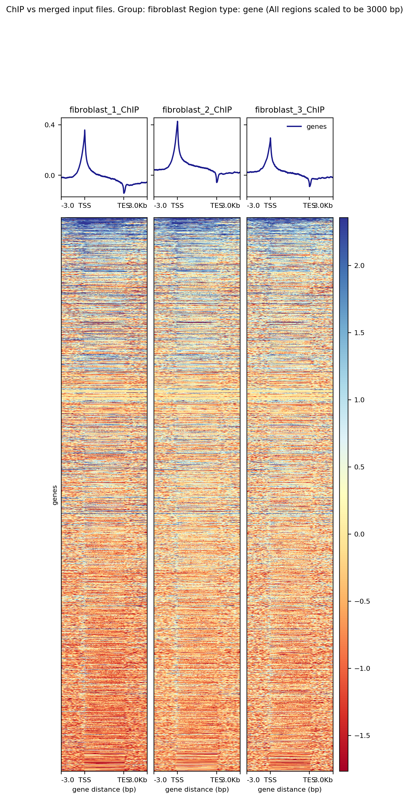

Heatmaps
========

bincs can be used to create heatmaps of ChIP-Seq data for predefined regions.

Example Output
--------------

   A log2-ratio heatmap showing each sample against the pooled input for the
   group fibroblast.

Targets
-------

There are three targets for creating regular heatmaps: log2_ratio_heatmaps,
chip_heatmaps and input_heatmaps. The log2_ratio_heatmaps creates a heatmap of
each ChIP sample against the pooled input for each group in the sample sheet.
The chip_heatmaps and input_heatmaps create heatmaps of the RPKM-normalized ChIP
or Input files for each group.

There is also a target for creating a heatmap of group vs group called
log2_ratio_group_vs_group_heatmap. It creates one graph per group comparison of
input-normalized ChIP groups against each other. This target requires that you
have more than one group in your sample sheet.

..
   .. code-block:: bash

      snakemake log2_ratio_heatmaps # or chip_heatmaps or input_heatmaps or
                                    # log2_ratio_group_vs_group_heatmap

Options
-------

There are several settings that can be used to choose which regions should be
included in the heatmaps and how much of each region to display.

Predefined Regions
~~~~~~~~~~~~~~~~~~

The regions list in the config file can be used to select which regions
should be graphed. If you are using a gencode gff3 The valid options are:

.. code-block:: yaml

   CDS, exon, five_prime_UTR, gene, start_codon, stop_codon,
   stop_codon_redefined_as_selenocysteine, three_prime_UTR, transcript,
   internal_exon

Using this list relies on having a gff3 annotation file set in your config. See
https://www.gencodegenes.org/

If you do not have a gencode gff3, the UCSC refgene database will be used. Then
the valid region options are:

.. code-block:: yaml

   regions:
     - exon
     - gene
     - internal_exon

Custom Regions
~~~~~~~~~~~~~~

If a you do not have a gff3 annotation available for your genome, you can use
the custom_regions option in the config. This is a dict where the keys are
region type names and the values are the path to a bed file denoting the regions.

.. code-block:: yaml

   custom_regions:
     quantiles_internal_exon: test_data/WT.internal_exon.bed
     quantiles_exon: test_data/WT.exon.bed
     quantiles_gene: test_data/WT.gene.bed

The bed files should have a header and at least six columns. You can give an
optional seventh column which must be called deepTools_group. It is used by
deeptools to show each group separately in the profileplots. In the example
below, the deepTools_group variable is used to show different quantiles of
expression separately. The deepTools_group variable must be sorted. If a seventh
column is used, you must use the exact header names shown below.

.. code-block:: tsv
   :caption: Example bed-file with regions to display in the heatmap.

   #chrom  start   end     name    score   strand  deepTools_group
   chr2    241252956       241253035       exon:ENST00000391975.5:11       .       -       0
   chr9    133103746       133103833       exon:ENST00000424572.1:5        .       -       0
   chr17   32208106        32208309        exon:ENST00000584692.1:3        .       +       0
   chr17   32207511        32207563        exon:ENST00000584692.1:2        .       +       0
   chr17   82236728        82236872        exon:ENST00000584689.5:3        .       +       0
   chr17   82235982        82236231        exon:ENST00000584689.5:2        .       +       0
   chr9    133104262       133104331       exon:ENST00000424572.1:4        .       -       0
   chr9    133105931       133106016       exon:ENST00000424572.1:3        .       -       0
   chr9    133106644       133106748       exon:ENST00000424572.1:2        .       -       0
   ...
   chr5    122391088       122391191       exon:ENST00000509154.6:3        .       +       75-100
   chr5    122336787       122336904       exon:ENST00000509154.6:2        .       +       75-100
   chr1    160282038       160282200       exon:ENST00000392220.2:5        .       -       75-100
   chr1    160282416       160282502       exon:ENST00000392220.2:4        .       -       75-100
   chr1    160282943       160283109       exon:ENST00000392220.2:3        .       -       75-100
   chr1    160283529       160283639       exon:ENST00000392220.2:2        .       -       75-100
   chr12   98832028        98832136        exon:ENST00000552748.5:2        .       -       75-100
   chr12   98829173        98829353        exon:ENST00000552748.5:3        .       -       75-100
   chr4    59429   59556   exon:ENST00000509152.3:2        .       +       75-100
   chr1    36307769        36307825        exon:ENST00000505871.6:3        .       +       75-100

Size of region around TSS/TES to graph
~~~~~~~~~~~~~~~~~~~~~~~~~~~~~~~~~~~~~~

To set the size of the regions before the TSS and after the TSS to graph, use the flags

.. code-block:: yaml

   tss_distance_gene: 3000
   tss_distance_other: 500

The setting tss_distance_gene will be used for all region names that contain "gene" in the name,
otherwise the setting tss_distance_other will be used.
